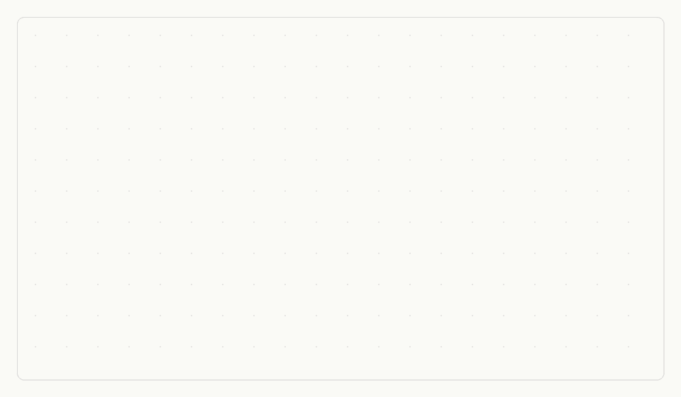

# pixelmesh

**Turn a live audience into a pixel display.**


Every phone that opens a URL becomes one pixel of a crowd-sized screen. A single camera pointed
at the audience finds each phone by the pattern it blinks, then effects sweep the room by real
spatial position.

No app install. No QR codes. No GPS, no seat map, no calibration step. The phones find
themselves.

<p align="center">
  
  
</p>

---

## How a show runs

**1. Connect.** The audience opens a URL. Each phone is assigned an ID.

**2. Blink.** Every unfound phone flashes a Manchester-encoded ID in white and black, 250 ms
per phase.

**3. Locate.** One camera decodes every blinking screen at once and pins each phone to its
position in the frame. First finds land around 11 seconds.

**4. Render.** Effects sequence across the crowd by position. Waves, ripples, spotlights, plus
games and a post-show report.

---

## Contents

- [How detection works](#how-detection-works) — the interesting part
- [Quick start](#quick-start)
- [HTTP API](#http-api)
- [Architecture](#architecture)
- [Effects](#effects)
- [Development](#development)
- [Documentation](#documentation)
- [Origins](#origins)
- [Status and licence](#status-and-licence)

---

## How detection works

The hard problem is not lighting phones up, it is knowing **which phone is where** without
asking anyone to do anything. pixelmesh solves it by making each screen say its own name in
light, and reading the whole room with one camera.

### Signal encoding

Each device blinks one cycle, continuously:

```
[ 4 dark guard phases ] [ Manchester( start + ID + ID + end ) ]
```

| Parameter | Value | Notes |
|-----------|-------|-------|
| `PHASE_MS` | 250 ms | Duration of each screen phase |
| `NUM_BITS` | 8 | Supports IDs 0 to 255 |
| `NUM_GUARD` | 4 | Dark guard phases before the data |
| `CYCLE_LEN` | 40 phases | 10.0 s per full cycle |

- **Manchester coded.** Bit `1` is `[bright, dark]`, bit `0` is `[dark, bright]`. Every bit
  carries a transition, so the receiver stays in step without a shared clock, and the screen
  averages to constant brightness rather than drifting the camera's auto-exposure.
- **The ID is sent twice per cycle**, so a single bit error is recovered by majority vote.
- **Timestamps are ground truth.** Decoding uses actual frame times against the known
  `PHASE_MS`, which makes it immune to variable camera frame rate.
- **The anchor is the end of the guard run**, not the start, so a phone arriving mid-cycle
  still decodes.

### What that costs

**Warmup.** The decoder needs brightness history spanning one full cycle (10.0 s) before it can
attempt anything. Expect 11 to 15 s from connecting to being found.

**Minimum frame rate.** About 12 fps, to sample 250 ms phases at three or more samples each.
The detector is capped at 20 fps, which leaves five samples per phase and returns the rest of
the machine to the display thread.

**Decode budget.** 50 ms per frame, candidates sorted highest-variance first so real phones
outrank noise. It is a fixed budget, so a busier room means each phone waits longer rather than
the system falling over.

The decoder is deliberately pessimistic. Failed points back off exponentially to a 5 s cap.
Phantom IDs within 60 px are deduplicated, though IDs belonging to connected phones are exempt,
because at real crowd density genuine neighbours sit 15 to 50 px apart. Phones that started
blinking before detection began are recovered by a backward scan over pre-guard history, with
confidence penalised for every bit it had to assume.

---

## Quick start

**Requirements**

- **Python 3.14**
- **A wired USB webcam.** Manual exposure matters more than resolution — auto-exposure hunts
  for the blink and flattens it. An Elgato Facecam 4K is auto-selected if present.
- **An HTTPS tunnel** (ngrok or equivalent) if phones join over the internet. Phones need a
  secure context; several browser features the client relies on are HTTPS-only.

```bash
pip install -r requirements.txt --break-system-packages
./run.sh
```

Homebrew's Python is externally managed (PEP 668), so plain `pip install` refuses. There is no
venv here by design, and `--break-system-packages` is what lets it write to the site-packages
the controller actually reads.

The controller will not launch directly — start it through `run.sh`, which wraps itself in a
`tmux` session named `pixelmesh` and reattaches if one already exists.

| Key | Action |
|-----|--------|
| `s` | Start server, tunnel and controller |
| `r` | Reload: kill everything and restart |
| `d` | Die: kill everything |
| `q` | Quit |

Server and tunnel start in parallel; the controller waits on the server's `/health` endpoint,
polling twice a second for up to 10 s before launching anyway.

**Local URLs**

| URL | What it is |
|-----|------------|
| `/admin/show_stats` | Live show state as JSON. Public, no auth |
| `/internal/dashboard` | Admin dashboard |
| `/internal/feed/v1` | Live camera feed. A canvas viewer in browsers, raw MJPEG to curl |
| `/internal/debug` | Debug runs: annotated video and calibration logs |

---

## HTTP API

Several admin routes are token-free but **local only** — anything arriving through the tunnel
is refused. They exist so a static page can drive a show without holding a token that changes
every launch.

| Route | Method | Purpose |
|-------|--------|---------|
| `/admin/show_stats` | GET | Counts, timings and current effect. Public, safe to poll |
| `/admin/mode` | GET / POST | Detection, recording and overlays on or off. Token required |
| `/admin/overlays` | POST | Camera overlays on or off |
| `/admin/recording` | POST | Start or stop recording |
| `/admin/recording/latest` | GET | The most recent **finished** recording |
| `/admin/end` | POST | End the show and put every phone on its closing card |

`show_stats` is additive by contract — keys are added, never renamed or removed, because other
things poll it:

```json
{
  "like_count": 122,
  "total_connected": 53,
  "detected": 51,
  "connected_now": 48,
  "detecting": false,
  "found_fastest_ms": 10250,
  "found_median_ms": 14800,
  "found_slowest_ms": 47000
}
```

Mode changes are *requested*, not applied. The recorder and detector live in the controller
process, so the server records a request with a sequence number and the controller applies it
on its next poll. That is what stops the two disagreeing about ordering.

---

## Architecture

```
browser clients  ──WS──►  server.py (FastAPI)
                               │
                        controller.py (Dear PyGui)
                         ┌─────┴──────┐
                   display thread  detection thread
                   (60fps camera)  (capped at 20fps)
                         │              │
                    camera.py    blink_detector.py
                    (OpenCV)     (grid sampler + decoder)
                                       │
                                 blink_encoder.py
                                 (Manchester codec)
```

Two processes, not one. `server.py` talks to phones; `controller.py` owns the camera, the
detector and the recorder.

The display and detection threads run independently, passing frames through a
`Queue(maxsize=1)` — if the detector is busy the frame is dropped and the camera loop continues
rather than blocking. The operator feed rides a side channel: a stream thread JPEG-encodes the
newest display frame and pushes it over one persistent WebSocket, with per-viewer stale-frame
dropping so a slow viewer skips ahead instead of building a queue.

The detector samples brightness on a grid every 8 px — roughly 25,000 points at 1080p — dense
enough that a phone 25 to 30 m away still lands inside a sample patch.

---

## Effects

Ten effects, sequenced by real spatial position rather than by index:

`Wave` · `Gradient` · `Pulse` · `Rainbow` · `Sparkle` · `Sections` · `Ring` · `Ripple` ·
`Spotlight` · `Groups`

Each has its own parameters, and changing one re-fires immediately. Seven are driveable from a
foot pedal; three need a mouse because they take a point or a colour per column.

---

## Development

```bash
python3 -m pytest tests/ -q
```

203 tests, no network and no camera required. They cover the Manchester codec round-trip across
frame rates, the decode pipeline, show state, shutdown behaviour and the admin routes.

Two areas are marked **frozen zone** in the roadmap: the blink protocol and the detection
gates. Both are shared truth across `blink_encoder.py`, the client renderer and the server's ID
pool, and all three have to move together. Changes there want measuring, not reasoning about.

---

## Documentation

| Document | What it covers |
|----------|----------------|
| [docs/running-a-show.md](docs/running-a-show.md) | Operator runbook: camera setup, detection, effects, games, post-show report |
| [docs/operations.md](docs/operations.md) | Debug capture, logs, load testing, crowd simulation, tuning knobs |
| [docs/ROADMAP.md](docs/ROADMAP.md) | What is next, and what was deliberately not done |
| [docs/TODO.md](docs/TODO.md) | Known gaps |

---

## Origins

Three generations of one idea, a crowd's phones as pixels:

- **[PixelPhones](https://seblee.me/2011/09/pixelphones-a-huge-display-made-with-smart-phones/)**
  (Seb Lee-Delisle, 2011) — phones held up and positioned by hand.
- **pixelmesh V1** — AprilTags on lock screens with homography calibration. It worked. Printing
  the tags was the friction.
- **pixelmesh V2** (this repo) — the phones find themselves. Each screen blinks its ID and one
  camera reads the whole room.

### Guiding principles

- **Time over position.** Sync clocks first; spatial layout is optional decoration.
- **Detection over configuration.** The system finds you; you don't set anything up.
- **Fast join over precision.** A phone joining five seconds late should still play.
- **Robustness over perfection.** Partial detections, dropped frames and reconnects are the
  norm, not the exception.

---

## Status and licence

A personal project, built for live events and run at real ones. It is shared because the
detection approach is worth reading, not because it is a product: no support, no stability
promise, and opinionated hardware assumptions.

**No licence is set.** Without one, default copyright applies and nobody else may legally use,
copy or modify this. A licence file needs adding before the repo means anything as open source.
