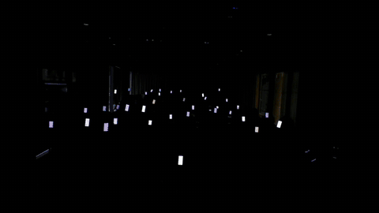
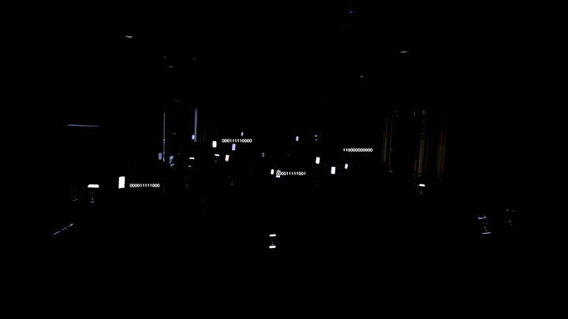
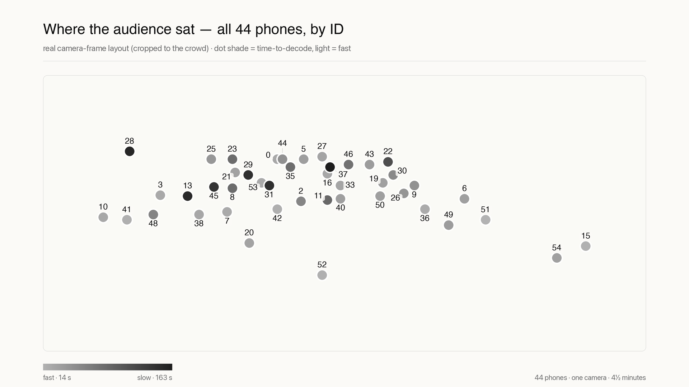

# pixelmesh

**Turn a live audience into a pixel display.**



Every phone that opens a URL becomes one pixel of a crowd-sized screen. A single camera pointed
at the audience finds each phone by the pattern it blinks — no app install, no QR codes, no GPS,
no seat map, no calibration step. Once located, every device renders light effects in perfect
sync: waves sweep the room, ripples spread from a click on the camera preview, and the crowd
becomes the show.

Built for live events and proven at them — 50+ phones located by one camera in real venues.
Headed for Brighton Dome (MotoCon26, October 2026). The public site lives at
[pixelmesh.live](https://pixelmesh.live) and deploys from this repo.

**How a show runs, in four beats:**

1. **Connect** — the audience opens `pixelmesh.show`. Each phone gets an ID and a like button to
   keep it busy.
2. **Blink** — the operator presses `D`. Every unfound phone flashes a Manchester-encoded ID,
   white/black at 300 ms per phase.
3. **Locate** — the camera decodes every blinking screen simultaneously and pins each phone to
   its position in the frame. Typical time to first find: 15–20 s.
4. **Render** — effects sequence across the crowd by real spatial position. Games, likes, and a
   post-show report round out the set.

---

## Contents

- [Quick start](#quick-start)
- [Running a show](#running-a-show)
- [What the audience sees](#what-the-audience-sees)
- [How detection works](#how-detection-works)
- [Architecture](#architecture)
- [Tuning & performance](#tuning--performance)
- [Operations](#operations)
- [The website](#the-website)
- [Origins](#origins)
- [Roadmap](#roadmap)

---

## Quick start

**Requirements**

- Python 3.10+
- [ngrok](https://ngrok.com) account with the reserved domain `pixelmesh.show`, set up as a
  cloud endpoint (see [Show URL & offline page](#show-url--offline-page))
- A wired USB webcam — the controller auto-selects an Elgato Facecam 4K if present

```bash
pip install -r requirements.txt
./run.sh
```

The controller must be started via `run.sh` — it will not launch directly. `run.sh` wraps itself
in a `tmux` session named `pixelmesh`; re-running it reattaches if the session already exists.

| Key | Action |
|-----|--------|
| `s` | Start server, ngrok, and controller |
| `r` | Reload — kill everything and restart |
| `d` | Die — kill everything |
| `q` | Quit |

Server and ngrok start in parallel. The controller waits up to 10 s for the server's `/health`
endpoint before launching.

**URLs**

| URL | Description |
|-----|-------------|
| `https://pixelmesh.show` | Audience URL — share this on screen. Offline, it serves a holding page that doubles as pre-show onboarding and auto-joins when the show starts |
| `https://pixelmesh.live` | Public site — deployed by DigitalOcean from `site/` on every push to `main` |
| `https://pixelmesh.show/admin/show_stats` | Live show stats JSON — `like_count`, `total_connected`, `detected`. Public, no auth |
| `http://localhost:8000/internal/dashboard` | Admin dashboard |
| `http://localhost:8000/internal/feed/v1` | MJPEG camera stream (60 fps, pushed frame-by-frame) |
| `http://localhost:8000/internal/debug` | Debug runs — annotated videos and calibration logs |

---

## Running a show

### 1. Camera setup

The camera **must be on manual exposure** before starting detection.

**Why auto-exposure breaks things:** the blink signal is a screen switching between full-white
and full-black at 300 ms per phase. Auto-exposure tracks and cancels the blink — the resulting
signal has a brightness range of ~0.28 instead of ~0.99, producing `empty_win` failures on every
decode attempt.

The Elgato Facecam 4K ignores both OpenCV and AVFoundation exposure locks — the firmware runs its
own internal AE loop. **The only reliable fix is Elgato Camera Hub:**

1. Open **Elgato Camera Hub**
2. Disable **Auto Exposure**
3. Set **ISO to 624**
4. Leave shutter at whatever gives stable 60 fps in your venue

**Watchdog:** `elgato.py` connects to Camera Hub via its local WebSocket API and monitors AE
throughout the session. Camera Hub occasionally re-enables AE on its own — the watchdog forces it
back off within 5 seconds. The sidebar shows live status, current AE state, and an ISO slider for
live adjustment. Manually-set ISO survives Camera Hub reconnects.

For other cameras: `AVCaptureExposureModeLocked` is applied at startup and re-applied if fps
drops below 8. `CAP_PROP_AUTO_EXPOSURE=0` and `CAP_PROP_EXPOSURE=-6` are also set as fallback.

**Signal quality:** if signal range drops below 0.5, an amber dot appears on the HUD. Detection
still works but takes 25–35 s instead of 13–15 s. Causes: AE compressing amplitude, low phone
brightness, or ambient light sensor dimming screens.

**Displays: plug in before starting, don't hot-unplug.** Disconnecting a display (projector
HDMI) while the controller runs wedges the GUI — GLFW cannot survive the macOS display-topology
change (MaccTech, Jul 2026: frozen app, `r` reload, ~90 s to full recovery including
re-detection). Connect the projector before `run.sh`, and stop the controller before unplugging.
If it happens mid-show: a watchdog in `run.sh` notices a dead controller within ~2 s and
restarts it automatically (bounded at 3 restarts per 60 s, then it gives up loudly in
`/tmp/pixelmesh-controller.log` so a crash-loop is visible). `r` remains the manual fallback.

### 2. Detection

Press **D** to start detection. The camera decodes each blinking screen and maps it to a position
in the room.



- **Blocked if nobody is connected** — `D` with no clients shows "No clients connected"
- **Partial re-detection** — already-located phones keep their positions; only unfound phones are
  asked to blink again
- **Auto-stops** when all connected phones are found
- **Positions persist** across detection runs — only cleared by an explicit Reset (`R`)
- **Identity survives reconnects** — WS drops (iOS backgrounding, network blips) keep the phone's
  blink ID and stored position for 30 minutes of silence; the phone returns to its located view
  immediately on reconnect
- **Dead socket eviction** — if `update_position` fails on a stale TCP connection,
  `_drop_connection` fires immediately so the phone reconnects and receives the message on its
  next `hello`
- **Clean state per run** — the detector's internal candidate set is cleared at the start of every
  detection session, preventing fps degradation across multiple runs without an app restart

Expect 15–20 s from a phone connecting to first detection at typical range. The HUD shows
`camera fps / detection fps` while detection is active.

**ROI (Region of Interest):** the detection grid normally covers the entire camera frame. ROI
crops it — excluding the top, bottom, left, or right edges as a fraction of the frame — so the
detector only looks where the audience actually is.

Why this matters: anything that changes brightness — a monitor, a moving light, a reflective
surface — can activate grid points and consume CPU. Trimming the ROI to the audience band
eliminates those false sources before they reach the detector; in venues with active stage
lighting it roughly doubles detection-thread throughput.

Use the sliders in the **SCENE** tab. The excluded region is dimmed on the camera feed and a blue
boundary line marks where detection begins. Sliders are disabled while detection is active;
changes take effect on the next run.

### 3. Effects

Click the sidebar buttons to fire effects. Each effect has its own parameter dialog (`...`
button) — changing a value immediately re-fires with the new settings. Effects are blocked until
at least one phone has been detected.

| Effect | Parameters |
|--------|------------|
| Wave | Colour, Speed, Direction, Frequency |
| Gradient | Colour, Speed, Direction |
| Pulse | Colour, BPM |
| Rainbow | Speed, Direction, Frequency |
| Ripple | Speed — click-armed; the controller fires it from your click point on the camera preview |
| Groups | Columns + a colour swatch per column (up to 16 stripes), Chase speed |
| Sparkle | Colour A, Colour B, Rate, Density — soft tinkle bloom that picks colour per-cycle |
| Sections | Colour A, Colour B, Speed, Columns, Rows |

The active effect is highlighted in orange in the sidebar. An animated thumbnail above the effect
list previews the selected effect in real time.

**Projection flip (`F`):** mirrors the MJPEG feed + controller preview so the projector reads the
right way round; the HUD redraws onto the flipped canvas so labels stay readable.

**Overlay modes (`P`):** toggle between showing blink IDs (0-based) or render order
(left-to-right spatial rank) on the camera feed. Render order is what the effects engine uses to
sequence phones across the crowd.

### 4. Avatar race

Every detected phone gets a procedurally-generated character — body colour, hat style, skin tone
all hashed from its blink ID — and races left-to-right on the stage projection (`/stage`). Tap
the phone to step forward; first across the finish line wins.

- **Target:** 40 taps to finish (`RACE_TAPS_PER_PLAYER` in `game.py`)
- **Tap rate cap:** ~12 taps/s per phone — beyond that taps are ignored
- **Progress broadcast:** 10 Hz; the stage eases each runner's displayed x toward the latest
  server position so motion stays smooth even on slow networks
- **Lanes auto-fit** — the track divides evenly across however many runners are in the round,
  scaling avatar size down so 70+ phones still fit cleanly
- **Phone-side avatar preview** — the user's own character is painted into the race card header
  alongside their live rank ("12th of 47"), so they can find themselves in a crowded projection
- **Winner overlay** — text-only, with looping confetti until the operator triggers the next
  thing; manual stop ends the round silently

Launch from the sidebar: **Start Avatar Race**. Open `/stage` on a second screen (or projector)
to display the race.

### 5. Bug game

A tap-reaction game. All phones receive a bug at random private intervals within a 20-second
round — each player's bug appears at an unpredictable moment. Lowest reaction time wins.

- **Round:** 20 seconds, hard wall-clock timer
- **Slot:** 1.4 seconds to tap once the bug appears
- **Timer bar:** drains over the full 20 s, synced to server time — all phones show the same
  remaining time regardless of when their bug appeared
- **Progress pill:** `X / Y tapped` shown live on every device

| Result | Display |
|--------|---------|
| Fastest tap | **YOU WIN** in gold |
| Tied fastest | **IT'S A DRAW** in gold |
| Tapped but not fastest | **NOT THIS TIME** with your time |
| Missed the slot | **YOU MISSED IT** in red |

Winner's phone number and time shown below in all cases. The controller leaderboard shows all
reaction times ranked fastest-first, with no-tap phones listed below a separator.

Launch from the sidebar: **Start Bug Game**. The leaderboard window opens automatically.

### 6. Likes

A global like counter on the waiting screen. Tap the thumbs-up to add to it — flying heart
animations play locally. Taps are batched server-side at ~3 broadcasts/second so simultaneous
taps from 300 people don't flood connections.

**Sidebar controls:** Reset Like Counter · Enable/Disable Likes

### 7. Post-show report

A plain-text summary is generated automatically every time the server is reset (`R`). The file is
saved silently to `debug/reports/`; detection-end runs (`D` off) open it in the default editor.

```
══════════════════════════════════════════════
   PIXELMESH — SHOW REPORT
   24 Apr 2026, 20:15
══════════════════════════════════════════════

AUDIENCE
  Connected:        47 phones
  Detected:         43  (91%)
  Missed:            4

DETECTION
  Started:        20:15:04
  Completed:      20:28:31  (13m 27s)
  Median time:    18.4s
  Fastest:        12.1s  — Phone 12  (conf 0.94)
  Slowest:        41.3s  — Phone 7   (conf 0.71)

ENGAGEMENT
  Likes:           284

BUG GAME
  Players:          43
  Tapped:           38  (88%)
  Winner:        Phone 24  —  142ms
  Median react:   387ms
  No tap:            5

══════════════════════════════════════════════
```

Sections are omitted if they didn't happen. Reports are kept indefinitely. Combined with the
per-run calibration logs and debug captures, every show leaves a full paper trail:



### Foot controller (BOSS FS-1-WL)

A wireless three-switch pedal for hands-free operation: switch 1 toggles detection, switch 2
steps through the effects (wave, gradient, pulse, rainbow, sparkle, sections), switch 3 toggles
video recording. One-time setup: pair via Audio MIDI Setup → MIDI Studio →
Bluetooth, then run `python3.10 midi.py --learn` and stomp each switch when prompted (the pedal's
messages depend on its power-on mode, so they are learned into `midi_map.json`, not hardcoded).
The controller scans for the pedal every 5 s, so it can connect or wake at any point in a session.
A **MIDI panel** at the bottom of the sidebar (below the tabs, visible from any tab) shows the
last 10 received commands, newest first - stomps, effect fires, connects, and any unmapped
presses - so pedal activity is verifiable at a glance mid-show.

### Controller hotkeys

| Key | Action |
|-----|--------|
| `D` | Toggle detection |
| `S` | Toggle clock sync |
| `H` | Toggle all camera overlays (blink streams, device IDs, ROI boundary) |
| `O` | Toggle device ID overlays |
| `P` | Toggle overlay mode (blink IDs / render order) |
| `F` | Flip projection (mirror MJPEG + preview) |
| `R` | Reset server |
| `Tab` | Toggle sidebar |
| `G` | Start/stop debug capture |
| `V` | Start/stop video recording |
| `Q` / `Esc` | Quit |

---

## What the audience sees

Phones cycle through these views as the show progresses:

| View | Shown when | What the audience sees |
|------|-----------|------------------------|
| `idle` | Disconnected / server reset | Black screen |
| `waiting` | Connected, show not started | "Get ready" + like button |
| `blinking` | Detection active, not yet found | White/black blink pattern |
| `located` | Position confirmed | Map showing their spot in the crowd |
| `missed` | Detection ended, not found | 3 red flashes → black |
| `effects` | Showtime | Synchronised light effect |
| `game_wait` | Game active, bug not yet appeared | Black screen |
| `game` | Bug game / avatar race UI | Tap-to-play card with personal avatar + rank (race) or bug-tap target (bug) |

Each card is a fixed full-screen div. `setView()` is the only point that changes the display —
cards are shown/hidden via `style.display`, never via CSS class toggles.

**Waiting screen** — shares the holding page's design language (wordmark, grid background,
breathing glow) so the audience sees one continuous brand from pre-show to found. A numbered
three-step card (keep the page open / brightness to full, auto-lock off / how to hold the
phone), the like button (tap: white screen-blink flash, a burst of scattering pixel squares, a
flying thumb; the count pops on every update including other people's likes), and a Wake Lock
request to keep the phone awake.

**Connection status bar** — fixed chrome above the home indicator, shown on the waiting and
located views only: a black band fading out at the sides with a pixel-square marker. Steady
pixel with an occasional double-blink wink = connected; continuous hard blinking = reconnecting;
triple-blink = just joined. Shows "Connecting…" from the instant a fresh page loads, so startup
can never look like a blank screen.

**Connection resilience** — a fresh page that cannot connect reloads to the holding page after
15 s; a mid-wait disconnect shows the amber state and hands over after 8 s; a liveness watchdog
on wall-clock time catches the states no socket event reaches (constructor hangs, iOS freezing
the page in background), with grace periods so a mid-handshake socket is never reloaded.

**Located screen** — "Found you!" with a position map: white dots for other detected phones, a
large animated green dot for this phone, and the pre-show reminders ("Hold your screen up when
the show begins · Brightness to full · Turn off auto-lock"). The green dot pulses at 2 Hz on a
`requestAnimationFrame` loop synced to the visibility API, so it restarts automatically when the
screen wakes from sleep.

---

## How detection works

### Signal encoding

Each device blinks one full cycle continuously:

```
[ 4 dark guard phases ]  [ Manchester(start + ID + ID + end) ]
```

| Parameter | Value | Notes |
|-----------|-------|-------|
| `PHASE_MS` | 300 ms | Duration of each screen phase |
| `NUM_BITS` | 9 | Supports IDs 0–511 |
| Cycle length | 13.2 s | 44 phases × 300 ms |

- Manchester: bit `1` → `[bright, dark]`, bit `0` → `[dark, bright]`
- ID transmitted twice per cycle — up to 1 bit error corrected via majority vote
- Decoding uses actual frame timestamps + known `PHASE_MS` as ground truth — immune to variable
  camera fps
- Anchor computed from the end of the guard run, so phones arriving mid-cycle decode correctly

**Warmup:** the decoder needs a brightness history spanning at least one full cycle (13.2 s)
before attempting a decode. Expect 15–20 s from connection to first detection.

**Minimum fps:** ~10 fps to reliably sample 300 ms phases (≥3 samples/phase).

### Decode pipeline behaviours

- **Decode backoff** — failed points retry at `min(interval × 2^failures, 5s)`. Counter resets on
  success.
- **Stream display gate** — the binary stream overlay is only shown once a point has been active
  ≥4 s with fewer than 6 consecutive failures.
- **Phantom ID suppression** — two IDs within 60 px are deduplicated; the lower-confidence one is
  dropped. Reduced from 120 px to allow phones closer together in a dense crowd (≈1.6 m exclusion
  radius at 30 m/1080p). IDs belonging to connected phones (`valid_ids`) are exempt: at meetup
  density real neighbours sit 15–50 px apart in frame, and the 16 Jul demo showed a decoded,
  still-blinking phone (conf 0.87) silently discarded for a whole run because a found neighbour
  40 px away outranked it. Only unassigned (phantom) IDs are dropped now; each exempted keep is
  logged once (`[blink] kept valid ID=…`).
- **Backward-scan decoder** — phones that started blinking before detection began are decoded
  from pre-guard history. Confidence penalised 5% per assumed bit.
- **Stale-entry eviction** — entries below gate for >13.2 s are evicted every 3 seconds
  (wall-clock). Logged at DEBUG: `[blink] evicted N stale pts from _ever_active (remaining=M)`.
- **Guard-phase extension** — after the main decode loop, points whose std has just dropped below
  gate are retried, recovering phones whose dark guard phase coincided with their warmup
  threshold crossing.

---

## Architecture

```
browser clients  ──WS──►  server.py (FastAPI)
                                │
                         controller.py (Dear PyGui)
                          ┌─────┴──────┐
                    display thread  detection thread
                    (60fps camera)  (background, ~50fps)
                          │              │
                     camera.py    blink_detector.py
                     (OpenCV)     (grid sampler + decoder)
                                        │
                                  blink_encoder.py
                                  (Manchester codec)
```

The display and detection threads run independently. Frames pass via `Queue(maxsize=1)` — if the
detector is busy the frame is dropped and the camera loop continues unblocked.

The sidebar is organised into three tabs: **SCENE** (exposure, ROI sliders, live information
panel — opens by default), **RUN** (detection, overlays, effects, server controls), and **GAME**
(bug game, likes).

| File | Role |
|------|------|
| `server.py` | WebSocket server, device assignment, effect broadcast, like counter |
| `controller.py` | Camera loop, GUI, detection thread management, exposure monitor |
| `effects.py` | Effect definitions, per-effect parameter storage, settings dialogs |
| `blink_encoder.py` | Manchester encoding / decoding |
| `blink_detector.py` | Grid sampler, variance gate, per-point decode, thread pool |
| `game.py` | Bug game + avatar race — server routes, tap dispatch by mode, controller UI |
| `public/stage.js` | Stage projection — avatar race rendering, confetti, winner overlay |
| `report.py` | Post-show report generator — writes plain-text summary to `debug/reports/` |
| `video_recorder.py` | Plain video recording via ffmpeg pipe |
| `camera.py` | Gamma, contrast helpers |
| `network.py` | HTTP helpers for controller → server calls |
| `elgato.py` | Camera Hub watchdog — AE monitor, ISO control via local WebSocket API |
| `state.py` | Shared state between threads |
| `log.py` | File logger (`debug/pixelmesh.log`) |
| `debug_capture.py` | Frame capture for offline analysis |
| `public/app.js` | Client-side blink renderer, effect engine, waiting/located/game UI |
| `ngrok.pixelmesh.yml` | Show tunnel — binds the internal endpoint behind the cloud endpoint |
| `ngrok.cloud-policy.yml` | Traffic policy for `pixelmesh.show`, incl. the offline holding page |
| `site/` | The public website — see [The website](#the-website) |
| `content/` | Posts, talk slides, and other written material |
| `tools/` | Offline analysis: detector replay, signal heatmaps, GIF/still generators |
| `testplan.md` | Field test checklist, incl. the must-pass list before Brighton |
| `ROADMAP.md` | Design notes for planned work |

---

## Tuning & performance

Key parameters in `blink_detector.py`:

| Parameter | Default | Notes |
|-----------|---------|-------|
| `grid_step` | 8 px | Distance between sample points. At step=8 a phone just 3 px wide always overlaps a patch. Covers phones at 25–30 m at 1080p. |
| `sample_radius` | 4 px | Patch radius — 8×8=64 px per point. Keeps the sampling matrix at 1.66 MB, fitting inside L2/L3 cache on M1. r=6 (3.7 MB) spills to RAM and makes `np.partition` 10× slower. |
| `brightness_pct` | 3 | Percentile used when sampling a patch. The ~2.8th percentile catches even a single dark pixel during the dark phase. |
| `min_recent_std` | adaptive | Auto-tuned to `EMA(p90(all stds)) × 3.5`, clamped 0.05–0.15. Asymmetric EMA (α=0.4 up, α=0.05 down) — a brightness spike raises the gate within 2–3 frames. |
| `recent_n` | 18 | Samples in recent window (~1.2 s at 15 fps). Reduced from 24 — ~25% cheaper `np.std` with no decode impact at typical frame rates. |
| `history_seconds` | 15.0 | Rolling brightness history per point. Reduced from 30 s — halves list size and `add_sample` trim cost; well above the 13.2 s minimum for a full decode cycle. |
| `decode_interval` | 0.2 s | Time between decode attempts per point (undiscovered phones only) |
| `roi_*_frac` | 0.0 | Fraction of frame excluded from the detection grid on each edge. Controlled via sidebar sliders. |

**Tested on Apple M1 Pro, 16 GB RAM.** Display thread runs at ~60 fps; detection thread at
~50 fps. The bottleneck at 300+ phones is not compute — it is the 13.2 s warmup each phone must
complete before its first decode attempt.

| Optimisation | Impact |
|---|---|
| `Queue(maxsize=1)` frame drop | Display loop never blocked by detector |
| 50 ms wall-clock decode budget | Prevents per-frame overrun regardless of phone count |
| Early-exit decoder at confidence ≥0.95 | ~7× speedup per decode with clean signal |
| No re-decode of found phones | Zero cost per frame once located |
| `sample_radius=4` — 1.66 MB matrix | Fits L2/L3 cache; avoids RAM latency |
| `np.std` over circular buffer | Single vectorised call, GIL released |
| Precomputed flat patch indices | One numpy gather per frame, no per-point slicing |
| Gated history recording | `add_sample` only called for active/gate-crossing points |
| Pre-allocated texture buffer | Eliminates 14 MB/frame allocation |
| Batched like broadcasts | ~3/s cap prevents O(clients²) WebSocket storms |

---

## Operations

### Debug capture

Press **G** to start/stop a debug run (auto-starts with detection). Each run is saved to a
friendly-named folder under `debug/` (e.g. `autumn-fox-42`). Runs are kept indefinitely — prune
manually if disk space matters.

```
debug/autumn-fox-42/
  run.mp4             ← annotated camera view (H.264, real-time encoded)
  calibration.log     ← time-to-detect and confidence per blink ID
  summary.json        ← per-frame detection summary
  frames/
    0000_raw.jpg      ← downscaled camera frame
    0000_gray.jpg     ← grayscale used for detection
    0000_contrast.jpg ← per-point variance heatmap
    0000_overlay.jpg  ← annotated overlay (throttled)
    0000.json         ← grid point brightness data
```

### Logs

| File | Contents |
|------|----------|
| `/tmp/pixelmesh-server.log` | FastAPI / uvicorn — HTTP, WebSocket, assignments, broadcasts, errors |
| `/tmp/pixelmesh-ngrok.log` | ngrok tunnel — connection status, forwarding address |
| `/tmp/pixelmesh-controller.log` | Controller stdout/stderr — startup errors, Dear PyGui exceptions |
| `debug/pixelmesh.log` | Blink detection diagnostics — gate/std stats, decode failures, effect triggers. Appended across restarts. |
| `debug/calibration_logs/YYYYMMDD_HHMMSS.log` | One file per detection session — time-to-detect and confidence per blink ID |
| `debug/reports/YYYYMMDD_HHMMSS.txt` | Post-show report — generated automatically on every reset |
| `debug/recordings/YYYYMMDD_HHMMSS.mp4` | Video recording (hotkey `V`). Not committed to git. |

### Show URL & offline page

`pixelmesh.show` is an always-on **cloud endpoint** at ngrok's edge, not a direct tunnel. The
agent (started by `run.sh` from `ngrok.pixelmesh.yml`) binds the internal endpoint
`https://pixelmesh-agent.internal`; the cloud endpoint's traffic policy forwards to it when the
agent is up and serves an edge-hosted holding page when it isn't — wordmark, "The show has not
yet begun", and a 10 s countdown that quietly `fetch`-probes the origin, reloading only when the
response stops carrying the `x-pixelmesh-holding` marker header (i.e. the show is actually up) —
no reload flash while waiting. No laptop involvement while offline, no `ERR_NGROK_3200`.

The policy (including the embedded holding-page HTML) is versioned at `ngrok.cloud-policy.yml`.
The dashboard serves whatever was pasted last — re-paste after editing the file
(dashboard → Universal Gateway → Endpoints → `pixelmesh.show` → Traffic Policy).

**How the pieces fit:**

| Piece | Where | Role |
|---|---|---|
| Reserved domain `pixelmesh.show` | ngrok dashboard → Domains | DNS for the show URL (CNAME at the registrar per ngrok's instructions) |
| Cloud endpoint on `pixelmesh.show` | dashboard → Endpoints | Always-on edge listener; runs the traffic policy |
| Traffic policy | pasted from `ngrok.cloud-policy.yml` | `forward-internal` to the agent; holding page when the forward fails **or** returns a 5xx (agent up, app closed) |
| Internal endpoint `pixelmesh-agent.internal` | claimed by the agent at start | Private rendezvous between edge and laptop — not publicly reachable |
| Agent authtoken | `~/Library/Application Support/ngrok/ngrok.yml` | Default agent config; `run.sh` passes it alongside the project config |
| Tunnel definition | `ngrok.pixelmesh.yml` | Binds the internal endpoint to `localhost:8000`, inspection off, compression on |

**One-time setup on a new ngrok account:**

1. Reserve `pixelmesh.show` under **Universal Gateway → Domains** and point the registrar's
   DNS at ngrok per the instructions shown.
2. **Endpoints → New → Cloud Endpoint**, bind `https://pixelmesh.show`.
3. Paste the contents of `ngrok.cloud-policy.yml` into the endpoint's Traffic Policy and save.
4. Put the account authtoken in the default agent config (`ngrok config add-authtoken …`).
   Nothing to configure for the internal endpoint — the agent claims it on start.

**Region:** the domain's "Region & IP resolution" is pinned to **Europe** in the dashboard
(Jul 2026). It defaults to global latency-aware DNS, but `pixelmesh.show` reaches ngrok via a
Namecheap ALIAS record, and ALIAS flattening resolves from Namecheap's US servers - so "global"
answered with US PoPs and every audience message crossed the Atlantic twice (RTT p50 273ms at
500 clients; 55ms once pinned EU). If the domain setup ever changes, re-verify with
`python3 tools/load_test.py --host pixelmesh.show --wss`.

**Verifying the three states** (from `run.sh`, `s` starts everything):

- Nothing running → `pixelmesh.show` shows the holding page (served at the edge).
- Full stack running → the audience app.
- Tunnel up but server stopped → still the holding page, via the 5xx catch.

### Load testing

`tools/load_test.py` simulates a crowd against a running server with the real protocol per
client (hello, assign, heartbeats, sync-ping RTT probes) plus a mid-hold like storm, and
reports percentiles with pass/fail verdicts. Local: `python3 tools/load_test.py --clients 500`.
Through the real edge: add `--host pixelmesh.show --wss`. Baselines (Jul 2026, M1 Pro):
500/500 clients, zero drops, RTT p50 4ms local / 55ms through the EU edge, server at 12% CPU.

### Performance sentinel

The display loop self-monitors frame pacing and logs a `[perf]` warning only when the average
exceeds 45 ms over a 5 s window (healthy is 24-40 ms) - the signature that caught the July
save_frame stall. Silence means pacing is fine.

### Client auto-reload

The server hashes `app.js` at startup into a `BUILD_ID`, stamped into both the page's script
tag and `server_hello`. The client compares the server's build against the one embedded in its
own page (not localStorage history — that reloaded already-current pages once per deploy), so a
fresh page always matches and connects once, while a stale parked page reloads exactly once.

- Same code + server restart → same hash, no reload
- New `app.js` + server restart → new hash, parked clients reload within seconds

---

## The website

[pixelmesh.live](https://pixelmesh.live) is a static site served by DigitalOcean App Platform
from the `site/` directory — **every push to `main` deploys it**. `main` is the release branch;
day-to-day work should land there deliberately.

- `site/index.html` is the whole page (styles and scripts inline); assets live in
  `site/public/` so the served URL structure matches the old FastAPI hosting — existing shared
  links (including `/telemetry/london-2026-06`) still resolve.
- Fonts are self-hosted in `site/public/fonts/`; there are no third-party requests.
- The hero loop, detection clip, poster, and `og-image.jpg` are cut from real show footage with
  ffmpeg — sources are the debug captures under `debug/` and the London opener edit.
- Brand rule: **pixelmesh is always lowercase**, and no em dashes in site copy.

---

## Origins

Three generations of one idea — a crowd's phones as pixels:

- **[PixelPhones](https://seblee.me/2011/09/pixelphones-a-huge-display-made-with-smart-phones/)**
  (Seb Lee-Delisle, 2011) — phones held up and positioned by hand.
- **pixelmesh V1** — AprilTags on lock screens, homography calibration. Worked; printing the
  tags was the friction.
- **pixelmesh V2** (this repo) — the phones find themselves. Each screen blinks its ID, one
  camera reads the whole room. No tags, no calibration, no install.

### Guiding principles

- **Time over position** — sync clocks first; spatial layout is optional decoration.
- **Detection over configuration** — the system finds you, you don't set anything up.
- **Fast join over precision** — a phone joining 5 seconds late should still play.
- **Robustness over perfection** — partial detections, dropped frames, and reconnects are the
  norm, not the exception.

---

## Roadmap

Full design notes in [ROADMAP.md](ROADMAP.md). Headlines:

- **Faster decode** — PHASE_MS 300→250ms cuts every timeline 17% with the ID space intact
- **Found-state visibility** — steady green on found, so raised phones show their status from behind
- **Blackout command** — instant all-phones-off for dramatic moments
- **Photo-light warning** — pre-show prompt + HUD alert when strobes degrade detection
- **Spatial coherence pre-filter** — kill lone-pixel noise before it reaches the decode budget
- **Drawn ROI** — free-hand polygon regions instead of edge percentages
- **Souvenirs** — a personal post-show page per phone: their pixel's story, as a shareable GIF
